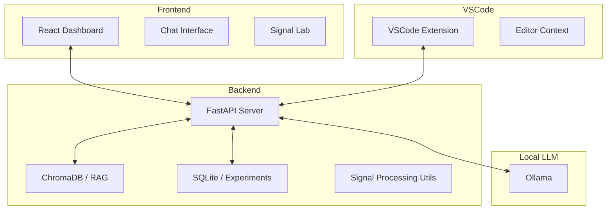

# DarakLab Copilot 🚀

[](https://ollama.ai/)
[](https://www.xilinx.com/products/design-tools/vitis/vitis-hls.html)
[](LICENSE)

**DarakLab Copilot** is a local-first AI research mentor and real-time coding assistant specifically engineered for **Intelligent and Reconfigurable Radar Signal Processing**. It combines a powerful web dashboard for laboratory analysis with a VSCode extension for real-time hardware acceleration development.

---

## 🌟 Key Features

### 📡 Signal Lab & Dashboard
*   **Real-time Visualization**: Interactive IQ data generation and FFT spectrum analysis.
*   **OFDM Prototyping**: Parameterized experimentation for channel estimation and pilot insertion.
*   **Lab Logger**: Integrated SQLite database to track experiments, synthesis metrics, and blockers.

### ⚡ Vitis HLS Assistant
*   **Pragma Optimization**: Real-time suggestions for `PIPELINE`, `UNROLL`, `DATAFLOW`, and `ARRAY_PARTITION`.
*   **Resource Estimation**: Automatic parsing of synthesis reports to flag DSP, LUT, and BRAM bottlenecks.
*   **Fixed-Point Conversion**: Intelligent suggestions to migrate `float` designs to `ap_fixed` for hardware efficiency.

### 🧠 Local RAG (Knowledge Base)
*   **Private Research**: Ingest PDFs, papers, and lab notes into a local **ChromaDB** vector store.
*   **Context-Aware Chat**: Converse with an AI that cites your own uploaded research documents.
*   **Zero-Cloud**: 100% local inference using **Ollama**—no data ever leaves your lab.

### 💻 VSCode Integration
*   **Real-time Analysis**: HLS-aware code explanations and optimization suggestions.
*   **Side-by-Side Analysis**: View FPGA tradeoffs and latency impacts directly in your editor.

---

## 🛠️ Architecture



---

## 🚀 Getting Started

### 1. Prerequisites
- **Ollama**: [Download here](https://ollama.ai/)
- **Python**: 3.9+
- **Node.js**: 18+

### 2. Prepare Models
```bash
ollama pull llama3.2:1b  # Lightweight default
ollama pull qwen2.5-coder:7b  # Recommended for coding
```

### 3. Installation
1.  **Clone the repo**:
    ```bash
    git clone https://github.com/yourusername/daraklab-copilot.git
    cd daraklab-copilot
    ```
2.  **Setup Backend**:
    ```bash
    cd backend
    pip install -r requirements.txt
    python main.py
    ```
3.  **Setup Frontend**:
    ```bash
    cd frontend
    npm install
    npm run dev
    ```

### 4. VSCode Extension
- Open the `extension` folder in VSCode.
- Run `npm install`.
- Press `F5` to launch the **Extension Development Host**.

---

## 🔬 Lab Context
Developed for researchers at **Darak Lab**, specializing in:
- Deep Learning augmented LS channel estimation for OFDM.
- Multi-armed-bandit-based early exit on Zynq SoC.
- RFSoC reference designs and PYNQ deployment.

---

## 📜 License
Distributed under the MIT License. See `LICENSE` for more information.

---
**Maintained by:** [Your Name/DarakLab]
